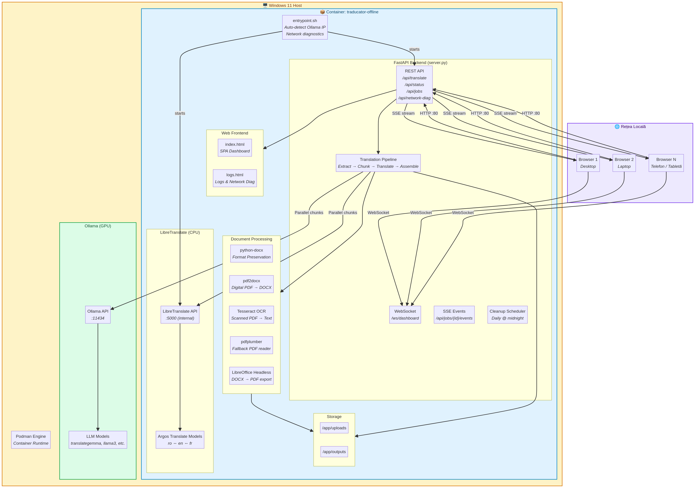

# Traducător Offline v4

O soluție completă de traducere a documentelor, containerizată, proiectată pentru a funcționa 100% offline pe o stație Windows 11. Aplicația oferă o interfață web accesibilă în rețeaua locală și suportă multiple motoare de traducere și formate de documente, cu accent pe păstrarea formatării.

## Arhitectura Sistemului

Soluția este construită pe o arhitectură modulară, centrată în jurul unui container Podman/Docker care rulează pe o mașină gazdă Windows. Această abordare asigură portabilitate maximă și un mediu de rulare izolat și consistent.

### Componente Cheie

| Strat           | Componentă                  | Tehnologie / Rol                                                                                                                                                           |
| --------------- | --------------------------- | -------------------------------------------------------------------------------------------------------------------------------------------------------------------------- |
| **Gazdă Windows** | **Podman Engine**           | Rulează și gestionează ciclul de viață al containerului.                                                                                                                   |
|                 | **Ollama (GPU)**            | (Opțional) Rulează pe gazdă pentru a oferi acces la modele lingvistice mari (LLM) accelerate hardware (GPU), asigurând traduceri de calitate superioară. Ascultă pe portul `11434`. |
| **Container**   | **entrypoint.sh**           | Script de pornire care efectuează diagnosticări de rețea și detectează automat adresa IP a serviciului Ollama de pe gazdă.                                                |
|                 | **FastAPI Backend**         | Nucleul aplicației, scris în Python. Expune un API REST, gestionează joburile de traducere, monitorizează sistemul și comunică în timp real cu frontendul.                     |
|                 | **Web Frontend**            | O interfață single-page (SPA) construită cu HTML/CSS/JS vanilla. Permite încărcarea fișierelor, monitorizarea progresului și configurarea joburilor.                         |
|                 | **LibreTranslate (CPU)**    | Motor de traducere integrat în container, bazat pe Argos Translate. Oferă traduceri rapide, eficiente pe CPU, pentru limbile pre-instalate (ro, en, fr).                    |
|                 | **Document Processing**     | O suită de unelte pentru procesarea documentelor: **python-docx** (păstrarea formatării DOCX), **pdf2docx** (conversie PDF digital), **Tesseract OCR** (extragere text din PDF scanat). |
|                 | **Storage**                 | Două directoare interne (`/app/uploads`, `/app/outputs`) pentru stocarea temporară a fișierelor originale și a celor traduse.                                               |

### Flux de Traducere

1.  **Upload**: Un utilizator încarcă un document (DOCX, PDF, TXT) prin interfața web.
2.  **Creare Job**: Backend-ul FastAPI primește fișierul, creează un job unic și îl adaugă la coadă.
3.  **Extragere Text**: Pipeline-ul de traducere determină tipul fișierului:
    *   **DOCX**: Textul este extras segmentat (paragraf cu paragraf, celulă de tabel cu celulă), păstrând referințe la stiluri și formatare.
    *   **PDF Digital**: Fișierul este convertit în DOCX folosind `pdf2docx` pentru a păstra layout-ul, apoi este tratat ca un fișier DOCX.
    *   **PDF Scanat**: Se rulează Tesseract OCR pentru a extrage textul, care este apoi asamblat într-un document text simplu.
    *   **TXT**: Textul este citit direct.
4.  **Fragmentare (Chunking)**: Textul extras este împărțit în fragmente (chunks) optimizate pentru a fi trimise motorului de traducere.
5.  **Traducere Paralelă**: Fragmentele sunt trimise în paralel către motorul de traducere selectat (Ollama sau LibreTranslate).
6.  **Asamblare**: Răspunsurile traduse sunt colectate și asamblate într-un nou document. Pentru DOCX, textul tradus este reinserat în structura originală, păstrând formatarea.
7.  **Notificare**: La finalizarea jobului, frontendul este notificat prin Server-Sent Events (SSE) și o notificare în browser este declanșată.
8.  **Download**: Utilizatorul poate descărca documentul tradus.

## Management și Deployment

Întregul ciclu de viață al aplicației este gestionat prin două scripturi batch interactive:

-   **`builder.bat` (Stația Online)**: Construiește imaginea containerului și o exportă într-un fișier `.tar` pentru transfer.
-   **`traducator_manager.bat` (Stația Offline)**: Oferă un meniu complet pentru a încărca imaginea, a porni/opri serviciile, a vizualiza loguri și a rula diagnosticări de rețea.

Pentru instrucțiuni detaliate de instalare și utilizare, consultați **[TUTORIAL_DOCKER.md](TUTORIAL_DOCKER.md)**.
