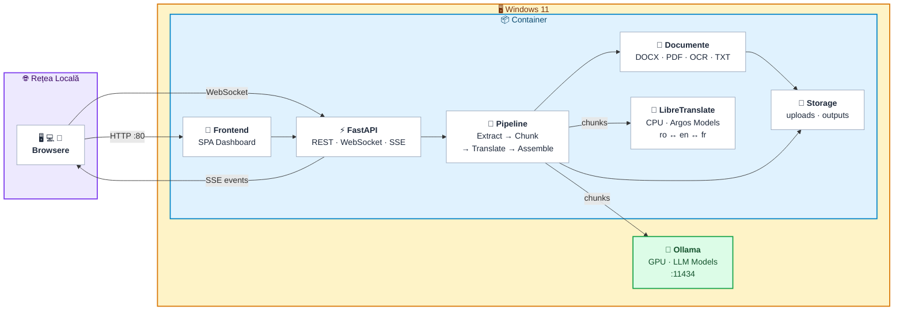
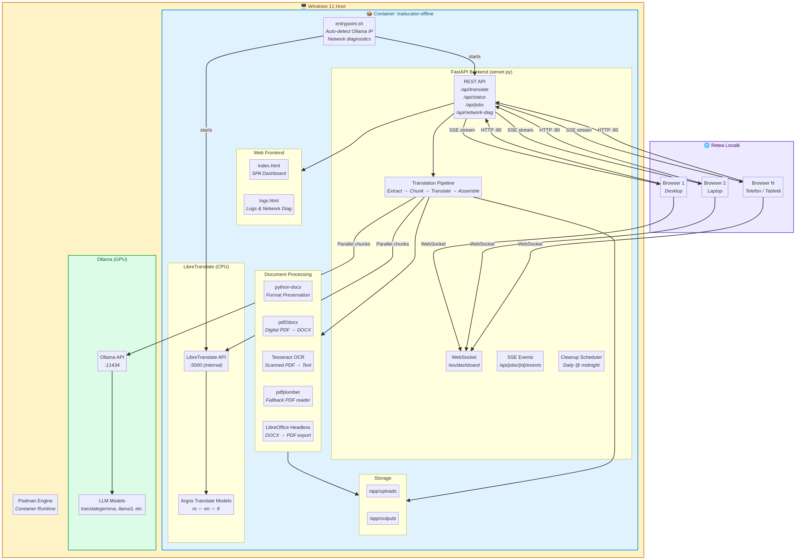

# Traducător Offline

O soluție completă de traducere a documentelor, containerizată, proiectată pentru a funcționa 100% offline pe o stație Windows 11. Aplicația oferă o interfață web accesibilă în rețeaua locală și suportă multiple motoare de traducere și formate de documente, cu accent pe păstrarea formatării.

## Arhitectura Sistemului

Soluția este construită pe o arhitectură modulară, centrată în jurul unui container Podman/Docker care rulează pe o mașină gazdă Windows. Această abordare asigură portabilitate maximă și un mediu de rulare izolat și consistent.

```mermaid
graph LR
    subgraph NET["🌐 Rețea Locală"]
        U["🖥️ 💻 📱<br/><b>Browsere</b>"]
    end

    subgraph HOST["🖥️ Windows 11"]
        subgraph CONTAINER["📦 Container"]
            FE["🎨 <b>Frontend</b><br/>SPA Dashboard"]
            API["⚡ <b>FastAPI</b><br/>REST · WebSocket · SSE"]
            PIPE["🔄 <b>Pipeline</b><br/>Extract → Chunk<br/>→ Translate → Assemble"]
            DOC["📄 <b>Documente</b><br/>DOCX · PDF · OCR · TXT"]
            LT["🐢 <b>LibreTranslate</b><br/>CPU · Argos Models<br/>ro ↔ en ↔ fr"]
            STORE["💾 <b>Storage</b><br/>uploads · outputs"]
        end

        OLL["🦙 <b>Ollama</b><br/>GPU · LLM Models<br/>:11434"]
    end

    U -->|"HTTP :80"| FE
    U -->|"WebSocket"| API
    FE --> API
    API --> PIPE
    PIPE --> DOC
    PIPE -->|"chunks"| LT
    PIPE -->|"chunks"| OLL
    DOC --> STORE
    PIPE --> STORE
    API -->|"SSE events"| U

    classDef net fill:#ede9fe,stroke:#7c3aed,stroke-width:2px,color:#3b0764
    classDef host fill:#fef3c7,stroke:#d97706,stroke-width:2px,color:#78350f
    classDef container fill:#e0f2fe,stroke:#0284c7,stroke-width:2px,color:#0c4a6e
    classDef ollama fill:#dcfce7,stroke:#16a34a,stroke-width:2px,color:#14532d
    classDef node fill:#fff,stroke:#94a3b8,stroke-width:1px,color:#1e293b

    class NET net
    class HOST host
    class CONTAINER container
    class OLL ollama
    class U,FE,API,PIPE,DOC,LT,STORE node
```

📷 Versiune statică (PNG)

### Componente Cheie

| Strat           | Componentă                  | Tehnologie / Rol                                                                                                                                                           |
| --------------- | --------------------------- | -------------------------------------------------------------------------------------------------------------------------------------------------------------------------- |
| **Gazdă Windows** | **Podman Engine**           | Rulează și gestionează ciclul de viață al containerului.                                                                                                                   |
|                 | **Ollama (GPU)**            | (Opțional) Rulează pe gazdă pentru a oferi acces la modele lingvistice mari (LLM) accelerate hardware (GPU), asigurând traduceri de calitate superioară. Ascultă pe portul `11434`. |
| **Container**   | **entrypoint.sh**           | Script de pornire care efectuează diagnosticări de rețea și detectează automat adresa IP a serviciului Ollama de pe gazdă.                                                |
|                 | **FastAPI Backend**         | Nucleul aplicației, scris în Python. Expune un API REST, gestionează joburile de traducere, monitorizează sistemul și comunică în timp real cu frontendul.                     |
|                 | **Web Frontend**            | O interfață single-page (SPA) construită cu HTML/CSS/JS vanilla. Permite încărcarea fișierelor, monitorizarea progresului și configurarea joburilor.                         |
|                 | **LibreTranslate (CPU)**    | Motor de traducere integrat în container, bazat pe Argos Translate. Oferă traduceri rapide, eficiente pe CPU, pentru limbile pre-instalate (ro, en, fr).                    |
|                 | **Document Processing**     | O suită de unelte pentru procesarea documentelor: **python-docx** (păstrarea formatării DOCX), **pdf2docx** (conversie PDF digital), **Tesseract OCR** (extragere text din PDF scanat). |
|                 | **Storage**                 | Două directoare interne (`/app/uploads`, `/app/outputs`) pentru stocarea temporară a fișierelor originale și a celor traduse.                                               |

### Flux de Traducere

1.  **Upload**: Un utilizator încarcă un document (DOCX, PDF, TXT) prin interfața web.
2.  **Creare Job**: Backend-ul FastAPI primește fișierul, creează un job unic și îl adaugă la coadă.
3.  **Extragere Text**: Pipeline-ul de traducere determină tipul fișierului:
    *   **DOCX**: Textul este extras segmentat (paragraf cu paragraf, celulă de tabel cu celulă), păstrând referințe la stiluri și formatare.
    *   **PDF Digital**: Fișierul este convertit în DOCX folosind `pdf2docx` pentru a păstra layout-ul, apoi este tratat ca un fișier DOCX.
    *   **PDF Scanat**: Se rulează Tesseract OCR pentru a extrage textul, care este apoi asamblat într-un document text simplu.
    *   **TXT**: Textul este citit direct.
4.  **Fragmentare (Chunking)**: Textul extras este împărțit în fragmente (chunks) optimizate pentru a fi trimise motorului de traducere.
5.  **Traducere Paralelă**: Fragmentele sunt trimise în paralel către motorul de traducere selectat (Ollama sau LibreTranslate).
6.  **Asamblare**: Răspunsurile traduse sunt colectate și asamblate într-un nou document. Pentru DOCX, textul tradus este reinserat în structura originală, păstrând formatarea — inclusiv **formatarea inline** (bold/italic/culoare aplicate pe porțiuni din mijlocul unui paragraf), nu doar formatarea întregului paragraf.
7.  **Notificare**: La finalizarea jobului, frontendul este notificat prin Server-Sent Events (SSE) și o notificare în browser este declanșată.
8.  **Download**: Utilizatorul poate descărca documentul tradus.

### Păstrarea formatării inline (DOCX)

Pentru paragrafele cu formatare mixtă (ex. un cuvânt **îngroșat** în mijlocul propoziției), aplicația grupează run-urile cu aceeași formatare și le marchează cu jetoane `⟦0⟧ ⟦1⟧…` înainte de traducere. Motorul este instruit să păstreze marcajele, iar textul tradus este redistribuit înapoi în run-urile originale, păstrând bold/italic/subliniere/culoare exact pe porțiunile corecte. Dacă motorul nu păstrează marcajele, se aplică automat un *fallback* sigur (tot textul în formatarea primului run), fără ca marcajele să apară vreodată în document.

**Prompt original TranslateGemma**: instrucțiunea de marcaje de mai sus modifică promptul trimis modelului. Pentru cazurile în care vrei fidelitate maximă față de model, există în *Setări* bifa **„Păstrează promptul original TranslateGemma"**. Când e activă (pentru Ollama, atât la documente cât și la text), modelul primește exact promptul nativ recomandat pe [pagina modelului](https://ollama.com/library/translategemma) — cu codurile de limbă și cele două linii goale, fără nicio instrucțiune de formatare. În acest mod formatarea inline NU mai este păstrată, iar la documente segmentele se traduc individual (fără batching).

### Verificare traduceri cu un al doilea LLM (review)

Pe lângă modelul de traducere, aplicația poate rula o **verificare de calitate** cu un model LLM generalist (configurabil în Setări → *Model de verificare*), tot prin Ollama. Pentru fiecare job finalizat, butonul **„🔍 Verifică"** (pe pagina *Job-uri* și în panoul de finalizare al unei traduceri) compară fiecare segment *original ↔ traducere* și returnează un verdict structurat:

- **verdict**: `ok` / `minor` / `major`
- **scor**: 1–5
- **probleme** identificate (acuratețe, omisiuni, terminologie, gramatică, fluență)
- **propunere** de traducere îmbunătățită (unde e cazul)

Rezultatele apar într-un panou cu sumar (câte segmente OK / minore / majore, scor mediu) și carduri per segment. **Filtrarea** se poate face din meniul derulant (doar cele cu probleme / toate / doar OK / minore / majore / erori) sau direct **prin click pe badge-urile din sumar** (OK / minore / majore / erori) — badge-ul activ este evidențiat. Verificarea rulează în paralel (concurență configurabilă) și folosește `format: json` la Ollama pentru răspunsuri robuste.

**Editare manuală**: fiecare segment are un câmp **editabil** „de aplicat", precompletat cu propunerea modelului (sau cu traducerea curentă, dacă nu există propunere). Poți corecta manual orice segment, inclusiv cele marcate OK; la editare segmentul se bifează automat pentru includere. Butonul **„Copiază"** copiază textul de aplicat în clipboard (cu *fallback* automat pentru contextele non-HTTPS, ex. acces în rețeaua locală pe HTTP).

**Context la verificare**: implicit, reviewer-ul primește și **N segmente vecine din original** (dinainte și de după, configurabil 0–5 în *Setări → Model de verificare*) ca text de context — doar pentru a înțelege referințe, terminologie și ton, fără a fi evaluat. Opțional, bifa **„Include și traducerile vecine în context"** adaugă și traducerea segmentelor vecine, pentru consistență terminologică și fluență între segmente. Contextul este limitat ca dimensiune pentru a încăpea în fereastra modelului (`num_ctx`).

**Aplicarea propunerilor**: fiecare propunere/editare poate fi bifată („Aplică..."), iar butonul **„Generează document revizuit"** reconstruiește documentul înlocuind segmentele acceptate cu traducerile îmbunătățite sau editate manual. Pentru fișierele **DOCX** revizuirea se aplică peste originalul, păstrând formatarea — inclusiv cea **inline** (reviewer-ul primește traducerea cu marcaje `⟦n⟧` și le păstrează în propunere, astfel încât bold/italic/culoarea se reaplică și pe textul îmbunătățit; segmentele *editate manual* nu poartă marcaje, deci pe acelea formatarea inline nu se reaplică); pentru TXT/PDF se generează un document cu textul corectat. Documentul revizuit se descarcă separat (cu sufixul **`_review`** în nume, ex. `document_en_revizuit_review.docx`), fără a suprascrie traducerea inițială.

**API**: `POST /api/jobs/{id}/review` (pornire; parametri: `model`, `concurrency`, `context_window`, `context_translations` ș.a.), `GET /api/jobs/{id}/review` (progres + rezultate), `POST /api/jobs/{id}/review/cancel` (anulare), `POST /api/jobs/{id}/review/apply` (aplică propunerile/editările alese — câmpurile `indices` și `edits`), `GET /api/jobs/{id}/review/download` (descarcă documentul revizuit), `POST /api/review-text` (verificare ad-hoc a unei perechi original/traducere). Fiecare cerere de verificare apare și în istoricul „CMD" (tip `review`).

### Verificarea unei traduceri externe (tab „Verifică traducere")

Pe lângă verificarea unui job propriu, există un tab dedicat **„Verifică traducere"** pentru documente traduse **în afara aplicației**. Încarci documentul **original** și documentul **tradus** (DOCX, PDF, TXT, MD), alegi limbile, apoi apeși **„Verifică traducerea"**. Aplicația segmentează ambele documente, **aliniază segmentele pe poziție** (paragraf cu paragraf) și deschide direct fereastra de verificare descrisă mai sus — cu tot ce ține de ea: verdicte/scor, editare manuală, filtrare, copiere, context vecin și generarea documentului revizuit cu sufix `_review`.

- **Aliniere**: dacă cele două documente au un număr diferit de segmente, se verifică partea comună și se afișează un **avertisment**. Pentru rezultate corecte, documentele ar trebui să aibă aceeași structură (același număr de paragrafe) — cazul tipic fiind un original și traducerea lui produsă cu aceeași aplicație.
- **Reutilizare**: intern se creează un „job de verificare" (`kind = "verify"`), marcat `completed`, care folosește exact aceleași endpoint-uri de review/apply/download. Apare și în lista **„Job-uri"**, marcat cu un badge **„verificare"**. Pentru DOCX, documentul revizuit se reconstruiește peste cel tradus, păstrând formatarea (inclusiv cea inline).
- **API**: `POST /api/verify-documents` (form-data: `original`, `translated`, `source_lang`, `target_lang`) → întoarce `job_id`, numărul de segmente aliniate și un flag `mismatch`. Verificarea propriu-zisă se pornește apoi prin endpoint-urile standard `…/review`.

### Istoric traduceri („CMD")

Pagina **`/prompts.html`** expune istoricul fiecărei cereri trimise către motorul de traducere: **promptul exact trimis** și **răspunsul brut primit**, împreună cu motorul, modelul, perechea de limbi, numărul de încercări, durata și eventualele erori. Util pentru depanare și transparență. Datele sunt disponibile și prin API: `GET /api/prompts` (filtrabil după `job_id` și `engine`), `DELETE /api/prompts` pentru golire.

## Management și Deployment

Întregul ciclu de viață al aplicației este gestionat prin două scripturi batch interactive:

-   **`builder.bat` (Stația Online)**: Construiește imaginea containerului și o exportă într-un fișier `.tar` pentru transfer.
-   **`traducator_manager.bat` (Stația Offline)**: Oferă un meniu complet pentru a încărca imaginea, a porni/opri serviciile, a vizualiza loguri și a rula diagnosticări de rețea.

Pentru instrucțiuni detaliate de instalare și utilizare, consultați **[TUTORIAL_DOCKER.md](TUTORIAL_DOCKER.md)**.

